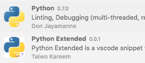
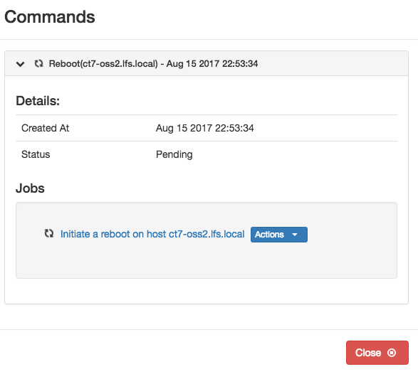
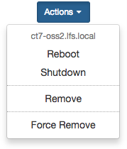
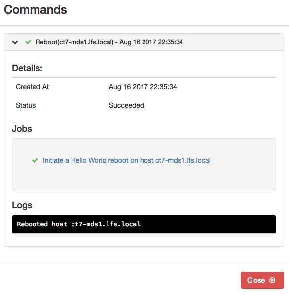

[**Table of Contents**](index.md)


# Contributing to the IML Backend Quick Guide

## General 
* [How to Contribute to Open Source](https://opensource.guide/how-to-contribute/)

## Prerequisites
### The installation of an IDE/Editor to develop IML code is not mandatory, however, the following recommendations are highly recommended:

* Install an IDE/Editor such as [PyCharm](http://www.jetbrains.com/pycharm/), [VS Code](https://code.visualstudio.com/), [Atom](https://atom.io/) or [Sublime](https://www.sublimetext.com/).
* For this guide, the [VS Code IDE/Editor](https://code.visualstudio.com/Download) has been installed along with the following plugins:
    * Python
    * Python Extended
    * Django Template
    
    

    
* To modify and test any Backend changes to IML, it will be necessary to install a working version of IML.
    * Create a **Vagrant** virtual cluster outined here: [Install IML on a Vagrant Virtual Cluster](Installing_IML_on_HPC_Storage_Sandbox.md).

    * Be sure to follow the steps for **Adding Servers**.

    * Create a Shared Mount from the guest machine to the vagrant virtual machine.
        * Follow these [Instructions](Create_Vagrant_Mount.md)

## On the Local machine, i.e., not the vagrant virtual machine.

For the desciption that follows, it will be assumed that the Vagrant file and virtual machine information reside in the directory:
``` 
~/vagrant-projects/vhpc 
```
## Contributing to the IML Backend
### Clone the desired Backend repository, for example, the main backend repository: 
 [intel-manager-for-lustre](https://github.com/intel-hpdd/intel-manager-for-lustre)
```
cd ~/vagrant-projects/vhpc
git clone git@github.com:intel-hpdd/intel-manager-for-lustre.git
```
### Create a branch, always work on a branch.
```
cd intel-manager-for-lustre
git checkout -b  my-fix
```
### Validate that the correct branch has been selected.
```
git branch
```
### Work on the branch.
```
Use VS Code and open ~/vagrant-projects/vhpc/intel-manager-for-lustre
```
## As an Example, make a small python code change.
The code that will be changed will modify the description displayed when rebooting a server. See the form below and observe the line that states: 

**Initiate a reboot on host oss2.lfs.local**



In VS Code, locate and edit the following file: **host.py**
```
intel-manager-for-lustre 
  > chroma-manager
    > chroma_core
      > models
        > host.py

Search for "Initiate a reboot"
```
On the line containing "Initiate a reboot", add **Hello World**:

Change this line:
```
def description(self):
        return "Initiate a reboot on host %s" % self.host
```
To look like this line:
```
def description(self):
        return "Initiate a Hello World reboot on host %s" % self.host
```
Save the file: **host.py**

## Using the python code change in your cloned repo

### In a seperate terminal, log into the **adm** node
* vagrant ssh adm

Log in as root
* su -

### Stop the IML running services
* chroma-config stop

Go to the cloned **intel-manager-for-lustre** repo on the /vagrant mount point where the code edits were made.
```
cd /vagrant/intel-manager-for-lustre
```

### Preserve the original files that came with the initial IML install.

```
cd /usr/share/chroma-manager/chroma_core/models

mv host.py host.py-orig
mv host.pyc host.pyc-orig
mv host.pyo host.pyo-orig
```

### Create symbolic links to point to the changes.
```
ln -s /vagrant/intel-manager-for-lustre/chroma-manager/chroma_core/models/host.py host.py 
```

### Start the IML services
* chroma-config start

## In a browser, go to the IML location
* [https://adm.lfs.local:8443](https://adm.lfs.local:8443)

## Verify that the small change worked.

Be sure to follow the instructions for adding servers in: [Install IML on a Vagrant Virtual Cluster](Installing_IML_on_HPC_Storage_Sandbox.md).

It is possible that the browser cache may require refreshing for the change to take place.

* Click on 
    * Configuration > Servers
    * Select the **Actions** pull-down for one of the Servers in the table.
    > Note: This will cause the selected server to reboot.

    * Select the option "Reboot" 
    


* The "Commands" form will pop up.
* Look for your modified message: "Initiate a **Hello World** reboot on host..."




---
# Congratulations! You just made a change to the IML Backend code.
---

## The process outlined above is the basic technique for modifying the Backend IML code.

## A note about starting and stopping chroma-config
* The amount of time to complete 
    * chroma-config start
    * chroma-config stop

* can be time consuming, however, the commands are still an effective way to ensure that all processes start and stop.

* A faster method to restart just the "gunicorn" process can be accomplished as follows:

    * **supervisorctl -c /usr/share/chroma-manager/production_supervisord.conf restart gunicorn**


* To check the IML services status

   * **supervisorctl -c /usr/share/chroma-manager/production_supervisord.conf status**

# Pushing the code change to github

### On your local machine, i.e., not the vagrant VM:

* cd ~/vagrant-projects/vhpc/intel-manager-for-lustre

Ensure you are on the proper branch
* git branch

Otherwise, change to the **my-fix** branch
* git checkout my-fix

Add and Commit the change.

* git status

* git add chroma-manager/chroma_core/models/host.py

* git commit -s 

Add the following comment:

```
This is a test fix for the backend

 - Changed a server description
```

* Save the commit 

## [Push to github](./Push_to_Github.md)


