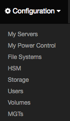

[**Table of Contents**](index.md)

# Contributing to the IML Frontend Quick Guide

## General 
* [How to Contribute to Open Source](https://opensource.guide/how-to-contribute/)

## Prerequisites
* Install an IDE/Editor such as [VS Code](https://code.visualstudio.com/), [Atom](https://atom.io/) or [Sublime](https://www.sublimetext.com/).
* For this guide, the [VS Code IDE/Editor](https://code.visualstudio.com/Download) has been installed along with the following plugins:
    * ESLint
    * Prettier - ESLint
    * Flow Language Support
    * Jest
* To modify and test any Frontend changes to IML, it will be necessary to install a working version of IML.
    * Create a **Vagrant** virtual cluster outined here: [Install IML on a Vagrant Virtual Cluster](Installing_IML_on_HPC_Storage_Sandbox.md).
    * Edit the **Vagrantfile** to allow for a shared mount. Immediately after the block that states *Create an admin server for the cluster*, add the following line:

    **config.vm.synced_folder ".", "/vagrant", type: "virtualbox"**

 * Ensure the ability to log in to the **adm** node as the root user:
    * vagrant up adm
    * vagrant ssh
    * su -
    * ls -al /vagrant
    * The Vagrantfile should be in the directory listing 

## On the Local machine, i.e., not the vagrant virtual machine.

For the desciption that follows, it will be assumed that the Vagrant file and virtual machine information reside in the directory:
``` 
~/vagrant-projects/vhpc 
```
## Contributing to the IML Frontend
### Clone the Frontend repo, aka, the [GUI](https://github.com/intel-hpdd/GUI) repo
```
cd ~/vagrant-projects/vhpc
git clone git@github.com:intel-hpdd/GUI.git 
```
### Create a branch, always work on a branch.
```
cd GUI
git checkout -b  my-fix
```
### Validate that the correct branch has been selected.
```
git branch
```
### Work on the branch.
```
Use VS Code and open ~/vagrant-projects/vhpc/GUI
```
### Example, make a small change
In VS Code, locate and edit the following file: **app-states.js**
```
GUI 
  > source
    > iml
      > app
        > app-states.js

Search for "Servers"
```
On the line containing "Servers", change **Servers** to **My Servers**:

Change this line:
```
<li><a tabindex="-1" id="server-conf-item" ui-sref="app.server({ resetState: true })">Servers</a></li>
```
To look like this line:
```
<li><a tabindex="-1" id="server-conf-item" ui-sref="app.server({ resetState: true })">My Servers</a></li>
```
Save the file: **app-states.js**

## Install dependencies and build the code
Install the external library dependencies
```
yarn install
```
Build the code and Pass all required tests listed in **pacakage.json**
```
yarn watch
```

### In a seperate terminal, log into the **adm** node
* vagrant ssh

Log in as root
* su -

Go to the cloned **GUI** repo where the change was made
* cd /vagrant/GUI

Type the command:
* **yarn link**

```
yarn link v0.27.5
success Registered "@iml/gui".
info You can now run `yarn link "@iml/gui"` in the projects where you want to use this module and it will be used instead.
Done in 0.60s.

```

### Stop the IML running services
* chroma-config stop

### Replace the **gui** that is running on the **adm** node with the newly cloned **gui**

* cd /usr/share/chroma-manager/ui-modules
* yarn link "@iml/gui"

### Start the IML services
* chroma-config start

## In a browser, go to the IML location
* [https://ct7-adm.lfs.local:8443](https://ct7-adm.lfs.local:8443)

## Verify that the small change worked
* Click on 
    * Configuration 
    * Verify that the pull down menu has the item: "My Servers"



## Congratulations!, you just made a change to the IML Frontend code.


---


