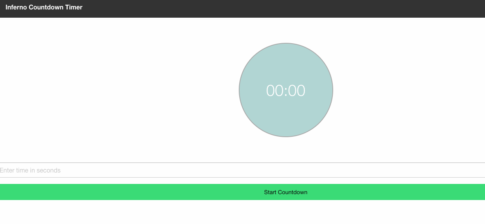

[**Table of Contents**](index.md)

# Create **Frontend** Unit Tests

## Unit tests are required to accompany every code feature that is delivered with IML.

IML currently uses **[jest](https://facebook.github.io/jest/)** as its test runner. Here is a simple exmple of some javascript code with a corresponding test case:

add.js
```function add(a, b) {
  return a + b;
}

module.exports = add;
```

add-test.js
```
const add = require('./add');
describe('add', () => {
  it('should add two numbers', () => {
    expect(add(1, 2)).toBe(3);
  });
});
```

## Tutorial
### An excellent tutorial about using jest with React may be found here:

[https://auth0.com/blog/testing-react-applications-with-jest/](https://auth0.com/blog/testing-react-applications-with-jest/)


The tutorial provides the source code that will make a Count Down Timer. 
The goal is to add the jest tests to carry out the unit tests.

See the the screenshot below:



## Snapshot Testing with Jest

### Snapshot testing is a feature of Jest which automatically generates text snapshots of your components. The saved snapshot may be used to compare what is generated with the code. If the code generated output matches the snapshot file, then the test will pass.

## A more complicated example

### In the GUI repository under source/iml/storage is a good example of using jest with Inferno code. 

Below are some code excerpts:

**storage-component.js**
```
export const StorageComponent = asViewer(
  'storage',
  ({
    storage: {
      resourceClasses,
      resources,
      config: { selectIndex, loading, sortKey, sortDesc, entries }
    },
    alertIndicatorB
  }: StorageProps) => {
    if (!resourceClasses) return;

    return (
      <div class="container container-full storage container">
        {selectIndex != null && resourceClasses.length
          ? <div>
              <h4 class="section-header">Storage Resources</h4>
              <TableFilter classes={resourceClasses} idx={selectIndex} />
              <div className={`table-container ${loading ? 'loading' : ''}`}>
                {resources &&
                  <ResourceTable
                    resourceClass={resourceClasses[selectIndex]}
                    resources={resources}
                    alertIndicatorB={alertIndicatorB}
                    sortKey={sortKey}
                    sortDesc={sortDesc}
                    entries={entries}
                  />}
                <AddStorageDevice />
              </div>
            </div>
          : <NoPlugins />}
      </div>
    );
  }
);

```

The coreesponding test:

**storage-component-test.js**
```
it('should render no plugins', () => {
    storage$.write({
      config: {
        sortDesc: false,
        sortKey: 'name',
        loading: false,
        selectIndex: 0,
        entries: 10,
        offset: 0
      },
      resourceClasses: [],
      resources: {
        meta: {
          limit: 10,
          next: null,
          offset: 0,
          previous: null,
          total_count: 0
        },
        objects: []
      }
    });

    expect(
      renderToSnapshot(
        <StorageComponent
          viewer={broadcaster(storage$)}
          alertIndicatorB={broadcaster(alertIndicator$)}
        />
      )
    ).toMatchSnapshot();
  });
