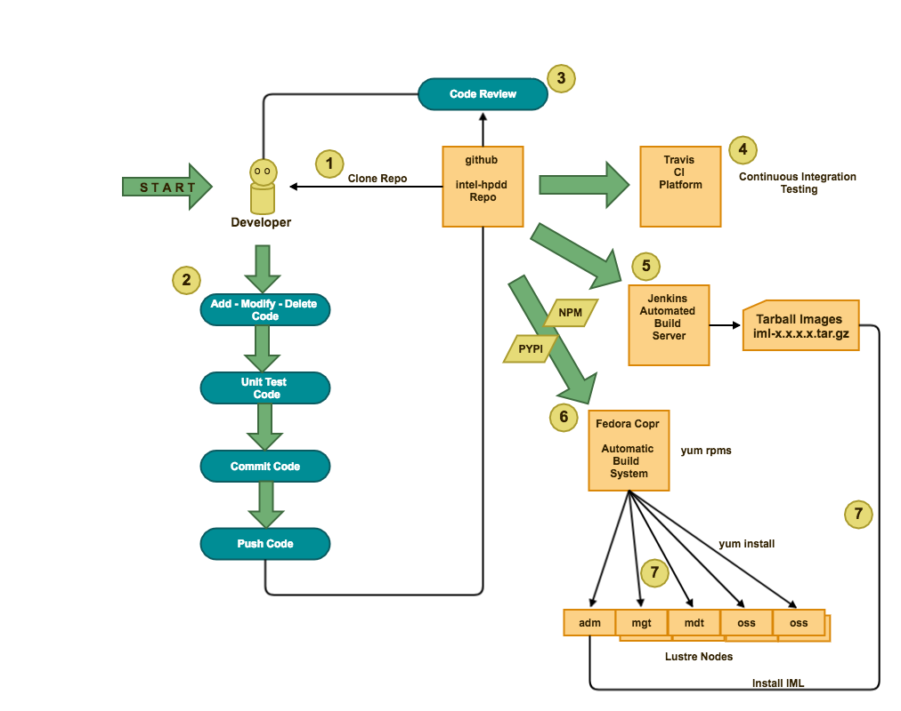

[**Intel® Manager for Lustre\* Developer Resources Table of Contents**](index.md)

# IML Developer Flow
## Overview


## Process for fetching, editing and pushing back code
```
Clone the desired repository, for example, GUI.git
```
* git clone git@github.com:intel-hpdd/GUI.git
* cd gui
```
List the current branches
```
* git branch 
* git branch --all
```
Create a new branch for example, my-new-branch
```
* git branch my-new-branch
```
Change to the branch called, my-new-branch
```
* git checkout my-new-branch
* Can also do:
* git checkout -b my-new-branch
``` 
  Modify, delete, add code
   Then commit the code
``` 
* git commit -s -m "This is my fix"
 
## To sync with the origin:
```
List the current origin
```
* git remote -v 
* git checkout master
```
fetch and rebase (Instead of fetch and merge)
```
* git pull  --rebase
* git checkout my-new-branch
```
Put your changes on top of what everyone else has done
```
* git rebase master
```
Push the changes
```
* git push origin my-new-branch