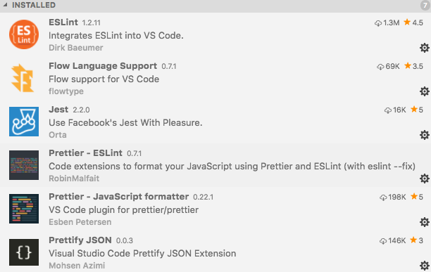

[**Table of Contents**](index.md)

# Contributing to the IML Frontend


## General 
* [How to Contribute to Open Source](https://opensource.guide/how-to-contribute/)

## Prerequisites
### The installation of an IDE/Editor to develop IML code is not mandatory, however, the following recommendations are highly recommended:

* Install an IDE/Editor such as [VS Code](https://code.visualstudio.com/), [Atom](https://atom.io/) or [Sublime](https://www.sublimetext.com/).
* For this guide, the [VS Code IDE/Editor](https://code.visualstudio.com/Download) has been installed along with the following plugins:
    * ESLint
    * Prettier - ESLint
    * Flow Language Support
    * Jest

    
    
* To modify and test any Frontend changes to IML, it will be necessary to install a working version of IML.

    * Create a **Vagrant** virtual cluster outined here: [Install IML on a Vagrant Virtual Cluster](Installing_IML_on_Vagrant.md).

    * Create a Shared Mount from the guest machine to the vagrant virtual machine.
        * Follow these [Instructions](Create_Vagrant_Mount.md)

## On the Local machine, i.e., not the vagrant virtual machine.

For the desciption that follows, it will be assumed that the Vagrant file and virtual machine information reside in the directory:
``` 
~/vagrant-projects/vhpc 
```
## Contributing to the IML Frontend
### Clone the Frontend repo, aka, the [GUI](https://github.com/intel-hpdd/GUI) repo
```
cd ~/vagrant-projects/vhpc
git clone git@github.com:intel-hpdd/GUI.git 
```
### Create a branch, always work on a branch.
```
cd GUI
git checkout -b  my-fix
```
### Validate that the correct branch has been selected.
```
git branch
```
### Work on the branch.
```
Use VS Code and open ~/vagrant-projects/vhpc/GUI
```
### As an Example, make a small change to the **Configuration** dropdown menu.
In VS Code, locate and edit the following file: **app-states.js**
```
GUI 
  > source
    > iml
      > app
        > app-states.js

Search for "Servers"
```
On the line containing "Servers", change **Servers** to **My Servers**:

Change this line:
```
<li><a tabindex="-1" id="server-conf-item" ui-sref="app.server({ resetState: true })">Servers</a></li>
```
To look like this line:
```
<li><a tabindex="-1" id="server-conf-item" ui-sref="app.server({ resetState: true })">My Servers</a></li>
```
Save the file: **app-states.js**

## Install dependencies and build the code

### Install yarn
Before you start using Yarn, you'll first need to install it on your system. 
* How to [Install yarn](https://yarnpkg.com/lang/en/docs/install/)


If yarn is installed properly, Install the external library dependencies

Type the command:
```
yarn install
```
Build the code and Pass all required tests listed in **package.json**
```
yarn watch
```

The watch command will leave the code in a state that will "watch" for further edits. If desired, the "watch" may be stopped by hitting ctrl-c

### In a seperate terminal, log into the **adm** node
* `vagrant ssh adm`

Log in as root
* `su -`

### Stop the IML running services
* `chroma-config stop`

### Create a symbolic link to the **gui** that is running on the **adm** node with the newly cloned **gui**.

The gui files currently reside at /usr/lib/iml-manager/iml-gui on the running system.

* `cd /usr/lib/iml-manager`

Preserve the original iml-gui files.
* `mv iml-gui iml-gui-orig`

Create the symbolic link.
* `ln -s /vagrant/GUI/dist iml-gui`

### Start the IML services
* `chroma-config start`

## In a browser, go to the IML location
* [https://adm.lfs.local:8443](https:/adm.lfs.local:8443)

## Verify that the small change worked.

It is possible that the browser cache may require refreshing for the change to take place.

* Click on 
    * Configuration 
    * Verify that the pull down menu has the item: "My Servers"
    * The image below also shows a change for "My Power Control"


---
# Congratulations! You just made a change to the IML Frontend code.
---

## The process outlined above is the basic technique for modifying the Frontend IML code.

## A note about starting and stopping chroma-config
* The amount of time to complete 
    * chroma-config start
    * chroma-config stop

* can be time consuming, however, the commands are still an effective way to ensure that all processes start and stop.

* A faster method to restart just the "view_server" process can be accomplished as follows:

    * **supervisorctl -c /usr/share/chroma-manager/production_supervisord.conf restart view_server**


* To check the IML services status

   * **supervisorctl -c /usr/share/chroma-manager/production_supervisord.conf status**


# Pushing the code change to github

### On your local machine, i.e., not the vagrant VM:

* `cd ~/vagrant-projects/vhpc/GUI`

Ensure you are on the proper branch
* `git branch`

Otherwise, change to the **my-fix** branch
* `git checkout my-fix`

Add and Commit the change.

* `git status`

* `git add source/iml/app/app-states.js`

* `git commit -s `

This will cause the **pre-commit** hooks to run.

Add the following comment:

```
This is a test fix for the frontend

 - Changed the Configuration dropdown label for Servers
```

* Save the commit 

## [Push to github](./Push_to_Github.md)
