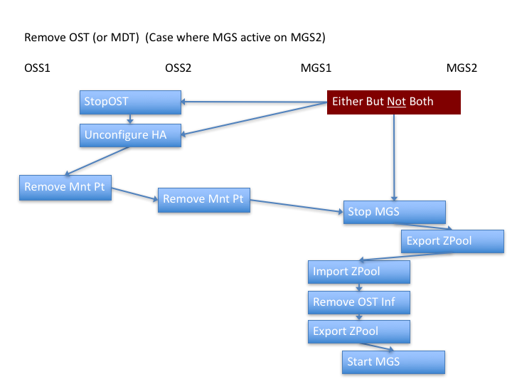
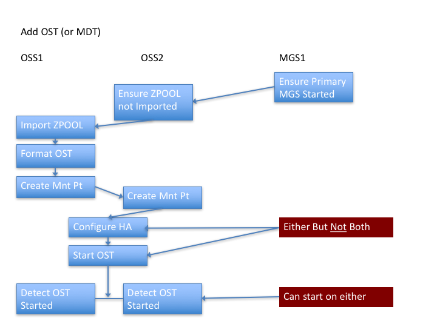
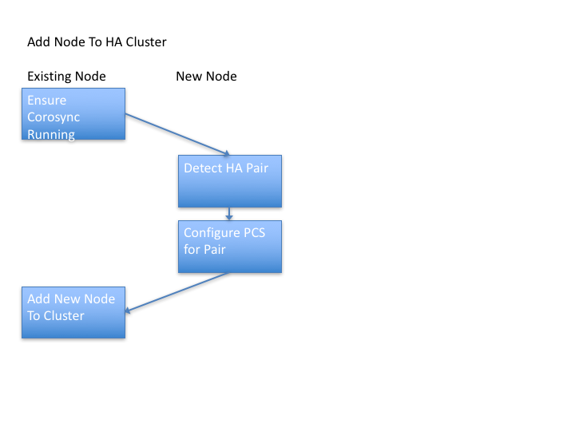

[**Intel® Manager for Lustre\* Developer Resources Table of Contents**](README.md)

sequence diagrams to illustrate import-export of zpools in HA configuration when starting stopping and adding ZFS-backed lustre targets in a HA configuration as performed in IML software

