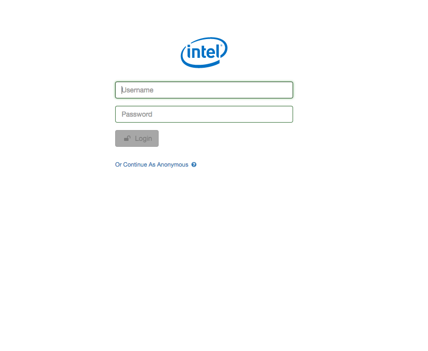
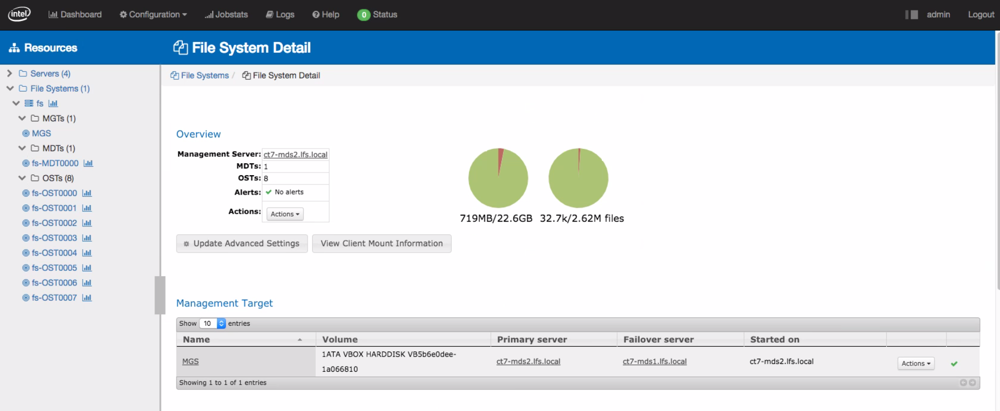
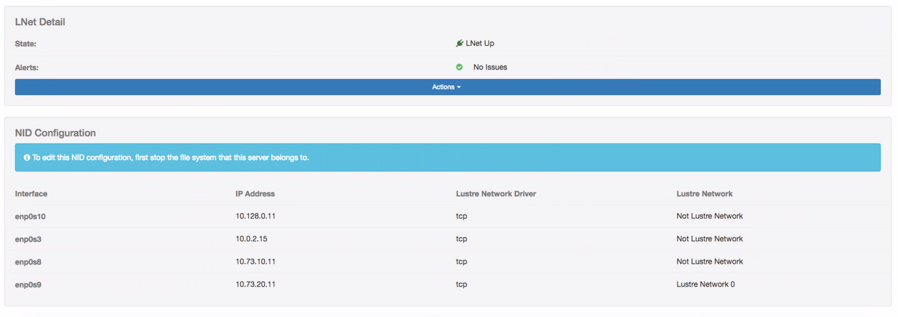
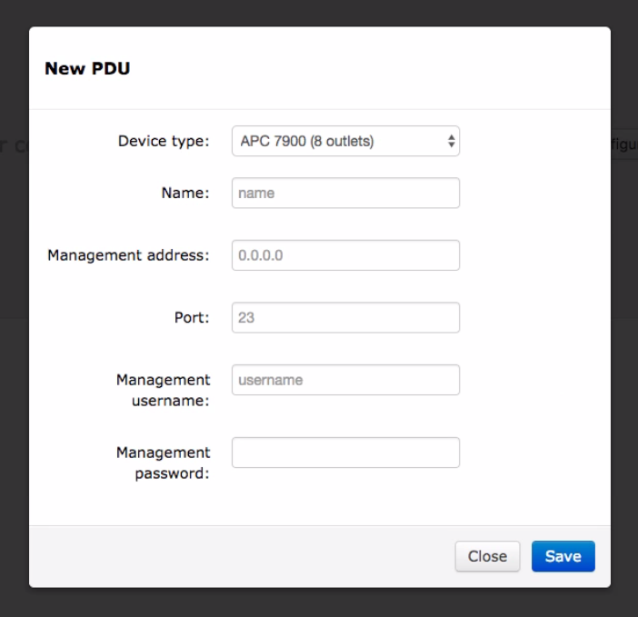
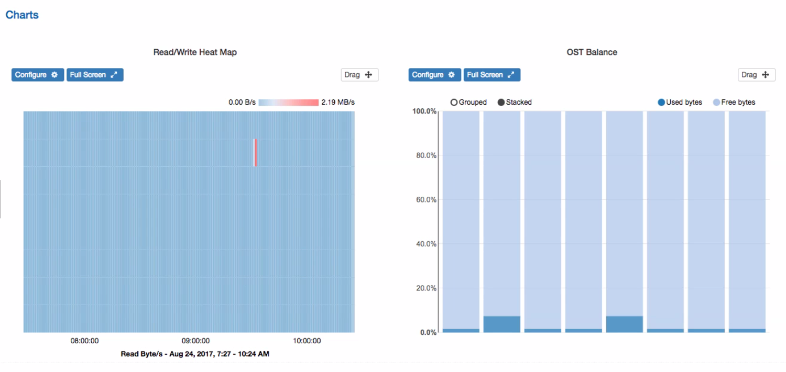
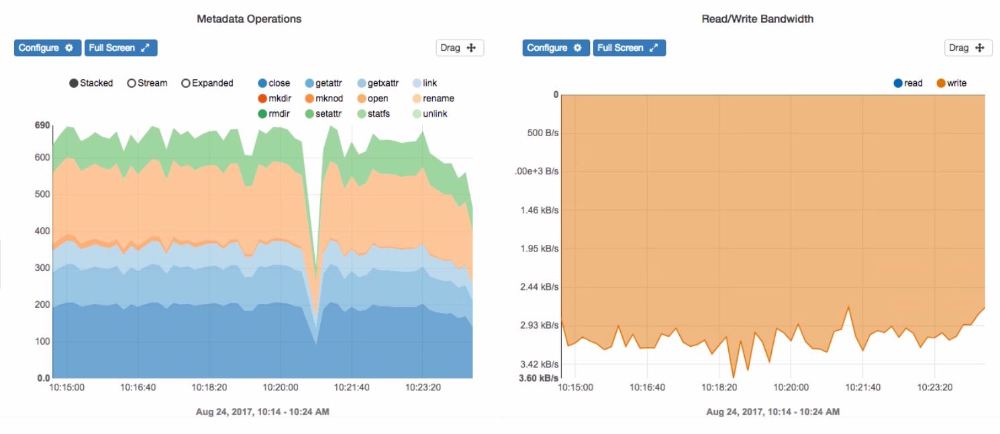
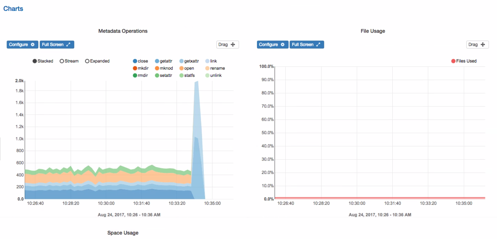

[**Table of Contents**](index.md)

# IML Screen Shots

## The examples below are intended to represent an overall sense of the IML look and feel. 

## IML Login Screen

---

## Configuration > Servers

---

## Configuration > Servers > Add Servers

---

## Configuration > File Systems

---

## Configuration > MGTS

---

## Configuration > Power Control > Add PDU

---

## IML Dash Board

---

## Dash Board

---

## Dash Board

---

## Dash Board

---

## Dash Board

---
