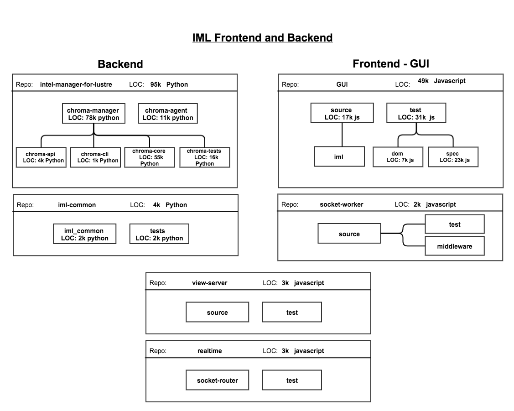

[**Table of Contents**](index.md)

# Introduction

## Background

### **IML** stands for Intel Manager for Lustre
### **IML** is responsible for the installation, configuration, monitoring, and overall management of [Lustre](http://lustre.org/).

Before accessing our source code repository for the first time, new contributors should have a good understanding of the tools and processes in place.
* Become very familiar with [git](Git_Info.md)
* Become familiar with the [IML codebase](https://github.com/intel-hpdd)
* Learn the IML [contributor workflow](Contributor_Workflow.md)
* Be ready to learn new things

## Frontend Code and Backend Code
IML consists of a **Frontend GUI** that is written primarily in **Node JS** and server-side **Backend** code that is written primarily in **python**. The codebase relies on many external dependencies and uses many services and APIs.

The [IML codebase](https://github.com/intel-hpdd) consists of many repositories due to the varying needs and varying dependencies.

### The primary IML repos of importance for a contributor are:

| Repo Name | Description |
|-----------|-------------|
| [intel-manager-for-lustre](https://github.com/intel-hpdd/intel-manager-for-lustre) | Consider this as the *Top level* repo populated mostly with python code |
| [GUI](https://github.com/intel-hpdd/GUI) | The Graphical User Interface for the Single Page Application, IML. Primaryily nodejs with angular and inferno |
| [manager-for-lustre-dependencies](https://github.com/intel-hpdd/manager-for-lustre-dependencies) | Dependencies needed for IML not available elsewhere. |
| [view-server](https://github.com/intel-hpdd/view-server) | Server client-side files |
| [socket-worker](https://github.com/intel-hpdd/socket-worker) | Off main thread data munging|
| [realtime](https://github.com/intel-hpdd/realtime) | WebSocket Proxy over RESTful API  |
| [Vagrantfiles](https://github.com/intel-hpdd/Vagrantfiles) | Used to generate a virtual lustre clustre with vagrant and virtualBox

## Dependencies for IML
### High level python dependencies include:
* The **django** web application framework
* **Tastypie** webservice API framework for Django used as the REST-api
* **django-south**, a tool to provide consistent, easy-to-use and database-agnostic migrations for Django applications.
* **Kombu** messaging library for python
* **Supervisor**, a system for controlling process state under linux
* **Robinhood**, a commission-free, online securities brokerage. 

## IML Services
### IML uses the following linux services:
* supervisor
* corosync               
* gunicorn 
* http_agent 
* job_scheduler 
* lustre_audit 
* plugin_runner
* power_control 
* realtime 
* stats
* syslog
* view_server  

